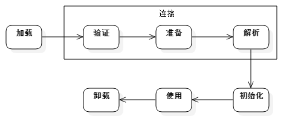

类从被加载到虚拟机内存中开始，到卸载出内存为止，它的整个生命周期包括：加载（Loading）、验证（Verification）、准备(Preparation)、解析(Resolution)、初始化(Initialization)、使用(Using)和卸载(Unloading)7个阶段。其中准备、验证、解析3个部分统称为连接（Linking）。如图所示。



加载、验证、准备、初始化和卸载这5个阶段的顺序是确定的，类的加载过程必须按照这种顺序按部就班地开始，而解析阶段则不一定：它在某些情况下可以在初始化阶段之后再开始，这是为了支持Java语言的运行时绑定（也称为动态绑定或晚期绑定）。以下陈述的内容都已HotSpot为基准。

# 类的加载过程

## 加载 Loading

"加载"(Loading)阶段是"类加载"(Class Loading)过程的第一个阶段，在此阶段，虚拟机需要完成以下三件事情：

1. 通过一个类的全限定名来获取定义此类的二进制字节流。
2. 将这个字节流所代表的静态存储结构转化为方法区的运行时数据结构。
3. 在Java堆中生成一个代表这个类的java.lang.Class对象，作为方法区这些数据的访问入口。

加载阶段即可以使用系统提供的类加载器在完成，也可以由用户自定义的类加载器来完成。加载阶段与连接阶段的部分内容(如一部分字节码文件格式验证动作)是交叉进行的，加载阶段尚未完成，连接阶段可能已经开始。

## 验证 Verification

验证是连接阶段的第一步，这一阶段的目的是为了确保Class文件的字节流中包含的信息符合当前虚拟机的要求，并且不会危害虚拟机自身的安全。验证阶段大致会完成4个阶段的检验动作：

1. 文件格式验证，是要验证字节流是否符合Class文件格式的规范，并且能被当前版本的虚拟机处理。如验证魔数是否0xCAFEBABE；主、次版本号是否正在当前虚拟机处理范围之内；常量池的常量中是否有不被支持的常量类型......该验证阶段的主要目的是保证输入的字节流能正确地解析并存储于方法区中，经过这个阶段的验证后，字节流才会进入内存的方法区中存储，所以后面的三个验证阶段都是基于方法区的存储结构进行的。
2. 元数据验证，是对字节码描述的信息进行语义分析，以保证其描述的信息符合Java语言规范的要求。可能包括的验证如：这个类是否有父类；这个类的父类是否继承了不允许被继承的类；如果这个类不是抽象类，是否实现了其父类或接口中要求实现的所有方法......
3. 字节码验证，主要工作是进行数据流和控制流分析，保证被校验类的方法在运行时不会做出危害虚拟机安全的行为。如果一个类方法体的字节码没有通过字节码验证，那肯定是有问题的；但如果一个方法体通过了字节码验证，也不能说明其一定就是安全的。
4. 符号引用验证，发生在虚拟机将符号引用转化为直接引用的时候，这个转化动作将在"解析阶段"中发生。验证符号引用中通过字符串描述的权限定名是否能找到对应的类；在指定类中是否存在符合方法字段的描述符及简单名称所描述的方法和字段；符号引用中的类、字段和方法的访问性(private、protected、public、default)是否可被当前类访问

验证阶段对于虚拟机的类加载机制来说，不一定是必要的阶段。如果所运行的全部代码确认是安全的， 可以使用 -Xverify：none 参数来关闭大部分的类验证措施，以缩短虚拟机类加载时间。

## 准备 Preparation

准备阶段是正式为类变量分配内存并设置类变量初始值的阶段，这些变量所使用的内存都将在方法区中进行分配。这时候进行内存分配的仅包括类变量（被static修饰的变量），而不包括实例变量，实例变量将会在对象实例化时随着对象一起分配在堆中。其次，这里所说的初始值"通常情况"下是数据类型的零值，假设一个类变量的定义为：

```java
public static int value=123;
```

那变量value在准备阶段过后的初始值为0而不是123.因为这时候尚未开始执行任何java方法，而把value赋值为123的putstatic指令是程序被编译后，存放于类构造器()方法之中，所以把value赋值为123的动作将在初始化阶段才会执行。至于"特殊情况"是指：

```java
public static final int value=123
```

即当类字段的字段属性是ConstantValue时，会在准备阶段初始化为指定的值，所以标注为final之后，value的值在准备阶段初始化为123而非0。

## 解析 Resolution

解析阶段是虚拟机将常量池内的符号引用替换为直接引用的过程。解析动作主要针对类或接口、字段、类方法、接口方法、方法类型、方法句柄和调用点限定符7类符号引用进行。

1. 符号引用（Symbolic Reference）：符号引用以一组符号来描述所引用的目标，符号可以是任何形式的字面量，只要使用时能无歧义地定位到目标即可。符号引用与虚拟机实现的内存布局无关，引用的目标并不一定已经加载到内存中。

2. 直接引用（Direct Reference）：直接引用可以是直接指向目标的指针、相对偏移量或是一个能间接定位到目标的句柄。直接引用是与虚拟机实现的内存布局相关的，如果有了直接引用，那么引用的目标必定已经在内存中存在。

## 初始化 Initialization

类初始化是类加载过程的最后一步，前面的类加载过程，除了在加载阶段用户应用程序可以通过自定义类加载器参与之外，其余动作完全由虚拟机主导和控制。到了初始化阶段，才真正开始执行类中定义的Java程序代码。

初始化阶段是执行类构造器

<clinit>()方法的过程。<clinit>()方法是由编译器自动 收集类中的所有类变量的赋值动作和静态语句块(static{}块)中的语句合并产生的 。</clinit></clinit>

但是对于初始化阶段虚拟机规范是严格规定了如下几种情况，如果类未初始化会对类进行初始化。

1. 创建类的实例
2. 访问类的静态变量 (除常量【 被final修辞的静态变量】 原因:常量一种特殊的变量，因为编译器把他们当作值(value)而不是域(field)来对待。如果你的代码中用到了常变量(constant variable)，编译器并不会生成字节码来从对象中载入域的值，而是直接把这个值插入到字节码中。这是一种很有用的优化，但是如果你需要改变final域的值那么每一块用到那个域的代码都需要重新编译。
3. 访问类的静态方法
4. 反射 如( Class.forName("my.xyz.Test") )
5. 当初始化一个类时，发现其父类还未初始化，则先出发父类的初始化
6. 虚拟机启动时，定义了main()方法的那个类先初始化

以上情况称为称对一个类进行 "主动引用" ，除此种情况之外，均不会触发类的初始化，称为 "被动引用"

1. 子类调用父类的静态变量，子类不会被初始化。只有父类被初始化。 。 对于静态字段，只有直接定义这个字段的类才会被初始化.
2. 通过数组定义来引用类，不会触发类的初始化
3. 访问类的常量，不会初始化类
