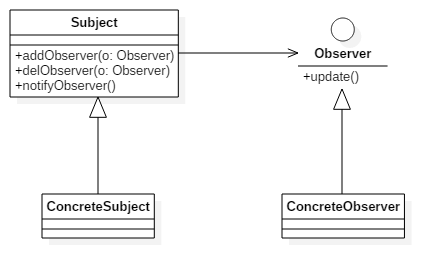

### 创建型模式

#### 单例模式 Singleton

单例类是指仅有一个实例的类。在系统中具有惟一性的组件可作为单例类，这种类的实例通常会占用较多的内存，或者实例的初始化过程比较冗长，因此随意创建这些类的实例会影响系统的性能。


```java
public class SingletonClass{
    private static SingletonClass instance=null;
    public static SingletonClass getInstance(){
        if(instance==null){
            synchronized(SingletonClass.class){
                if(instance==null){
                    instance=new SingletonClass();
                }
            }
        }
        return instance;
    }
    private SingletonClass(){}
}
```
**特点**：
1. 某个类只能有一个实例，单例模式的类只提供私有的构造函数
2. 它必须自行创建这个实例，类定义中含有一个该类的静态私有对象
3. 它必须自行向整个系统提供这个实例，该类提供了一个静态的公有的函数用于创建或获取它本身的静态私有对象。


#### 原型模式 Prototype

用原型实例指定创建对象的种类，并通过拷贝这些原型创建新的对象。原型模式主要用于对象的复制。


```java
class Prototype implements Cloneable {  
    public Prototype clone(){  
        Prototype prototype = null;  
        try{  
            prototype = (Prototype)super.clone();  
        }catch(CloneNotSupportedException e){  
            e.printStackTrace();  
        }  
        return prototype;   
    }  
}  

class ConcretePrototype extends Prototype{  
    public void show(){  
        System.out.println("原型模式实现类");  
    }  
}  

public class Client {  
    public static void main(String[] args){  
        ConcretePrototype cp = new ConcretePrototype();  
        for(int i=0; i< 10; i++){  
            ConcretePrototype clonecp = (ConcretePrototype)cp.clone();  
            clonecp.show();  
        }  
    }  
}  
```
**特点**：

1. 使用原型模式创建对象比直接new一个对象在性能上要好的多，因为Object类的clone方法是一个本地方法，它直接操作内存中的二进制流，特别是复制大对象时，性能的差别非常明显。
2. 使用原型模式的另一个好处是简化对象的创建，使得创建对象就像我们在编辑文档时的复制粘贴一样简单。

**注意**：

1. 使用原型模式复制对象不会调用类的构造方法。所以，单例模式与原型模式是冲突的。
2. Object类的clone方法只会拷贝对象中的基本的数据类型，对于数组、容器对象、引用对象等都不会拷贝。原型模式中的数组、容器对象、引用对象等要另行拷贝。

```java
ublic class Prototype implements Cloneable {  
    private ArrayList list = new ArrayList();  
    public Prototype clone(){  
        Prototype prototype = null;  
        try{  
            prototype = (Prototype)super.clone();  
            prototype.list = (ArrayList) this.list.clone();  // 私有的数组手动拷贝
        }catch(CloneNotSupportedException e){  
            e.printStackTrace();  
        }  
        return prototype;   
    }  
}  
```

#### 建造者模式 Builder

将一个复杂对象的构建与它的表示分离，使得同样的构建过程可以创建不同的表示。建造模式是将复杂的内部创建封装在内部，对于外部调用的人来说，只需要传入建造者和建造工具，对于内部是如何建造成成品的，调用者无需关心。


1. Builder：给出一个抽象接口，以规范产品对象的各个组成成分的建造。这个接口规定要实现复杂对象的哪些部分的创建，并不涉及具体的对象部件的创建。
2. ConcreteBuilder：实现Builder接口，针对不同的商业逻辑，具体化复杂对象的各部分的创建。 在建造过程完成后，提供产品的实例。
3. Director：调用具体建造者来创建复杂对象的各个部分，在指导者中不涉及具体产品的信息，只负责保证对象各部分完整创建或按某种顺序创建。
4. Product：要创建的复杂对象。

```java
interface Builder {
    Product getProduct();
    void setPart(String arg1, String arg2);
}

//具体建造工具
class ConcreteBuilder implements Builder {
    private Product product = new Product();
    @Override
    public Product getProduct() {
        return product;
    }
    @Override
    public void setPart(String arg1, String arg2) {
        product.setName(arg1);
        product.setType(arg2);
    }
}

//建造者
class Director {
    private Builder builder = new ConcreteBuilder();

    public Product getProduct(){
        builder.setPart("AAA","BBB");
        return builder.getProduct();
    }
}


class Product {
    private String name;
    private String type;
    public void showProduct(){
        System.out.println("名称："+name);
        System.out.println("型号："+type);
    }

    public void setName(String name) {
        this.name = name;
    }

    public void setType(String type) {
        this.type = type;
    }
}

public class Client {
    public static void main(String[] args){
        Director director = new Director();
        Product product1 = director.getProduct();
        product1.showProduct();
    }
}
```

**特点**：

1. 建造者模式的封装性很好。使用建造者模式可以有效的封装变化，在使用建造者模式的场景中，一般产品类和建造者类是比较稳定的，因此，将主要的业务逻辑封装在导演类中对整体而言可以取得比较好的稳定性。
2. 建造者模式很容易进行扩展。如果有新的需求，通过实现一个新的建造者类就可以完成，基本上不用修改之前已经测试通过的代码，因此也就不会对原有功能引入风险。

#### 工厂方法模式 Factory Method

定义一个用于创建对象的接口，让子类决定实例化哪一个类，工厂方法使一个类的实例化延迟到其子类。工厂模式是编程中经常用到的一种模式，工厂模式根据抽象程度的不同分为三种：
1. 简单工厂模式（静态工厂模式）
2. 工厂方法模式（当前介绍的模式）
3. 抽象工厂模式（[下一节介绍](#抽象工厂模式-Abstract-Factory)）


**特点**：

不管是简单工厂模式，工厂方法模式还是抽象工厂模式，他们具有类似的特性，所以他们的适用场景也是类似的：
1. 作为一种创建类模式，在任何需要生成复杂对象的地方，都可以使用工厂方法模式。
2. 调用者自己组装产品需要增加依赖关系时，可以考虑使用工厂模式。将会大大降低对象之间的耦合度。
3. 当需要系统有比较好的扩展性时，可以考虑工厂模式，不同的产品用不同的实现工厂来组装。

**注意**： 复杂对象适合使用工厂模式，而简单对象，特别是只需要通过new就可以完成创建的对象，无需使用工厂模式。如果使用工厂模式，就需要引入一个工厂类，会增加系统的复杂度。


```java
interface Product {
    public void productMethod();
}
interface Creator {
    public Product createProduct();
}

class ConcreteProduct implements Product {
    public void productMethod() {
        System.out.println("产品");
    }
}

class Factory implements Creator {
    public ConcreteProduct createProduct() {
        return new ConcreteProduct();
    }
}

public class Client {
    public static void main(String[] args) {
        Factory factory = new Factory();
        ConcreteProduct prodect = factory.createProduct();
        prodect.productMethod();
    }
}
```


#### 抽象工厂模式 Abstract Factory

为创建一组相关或相互依赖的对象提供一个接口，而且无需指定他们的具体类。抽象工厂模式用来创建一组相关或者相互依赖的对象。他与工厂方法模式的区别就在于，工厂方法模式针对的是一个产品等级结构；而抽象工厂模式则是针对的多个产品等级结构。在编程中，通常一个产品结构，表现为一个接口或者抽象类，也就是说，工厂方法模式提供的所有产品都是衍生自同一个接口或抽象类，而抽象工厂模式所提供的产品则是衍生自不同的接口或抽象类。


```java
interface Product1 {
    public void show();
}
interface Product2 {
    public void show();
}
interface Creator {
    public Product1 createProduct1();
    public Product2 createProduct2();
}

class ConcreteProduct1 implements Product1 {
    public void show() {
        System.out.println("这是1型产品");
    }
}

class ConcreteProduct2 implements Product2 {
    public void show() {
        System.out.println("这是2型产品");
    }
}

class Factory implements Creator{
    public Product1 createProduct1() {
        return new ConcreteProduct1();
    }
    public Product2 createProduct2() {
        return new ConcreteProduct2();
    }
}

public class Client {
    public static void main(String[] args){
        Creator factory = new Factory();
        factory.createProduct1().show();
        factory.createProduct2().show();
    }
}
```
**特点**：
抽象工厂模式除了工厂模式共有特点外，独特的优点就是可以在类的内部对产品族进行约束。所谓的产品族，一般或多或少的都存在一定的关联，抽象工厂模式就可以在类内部对产品族的关联关系进行定义和描述，而不必专门引入一个新的类来进行管理。

#### 创建类模式总结

创建类模式主要关注对象的创建过程，将对象的创建过程进行封装，使客户端可以直接得到对象，而不用去关心如何创建对象。创建类模式好处：

1.  降低了对象间的耦合，提高了对象复用的可能。（缺点是组装类的任务都交给了最终调用的客户端程序，增加了客户端程序的复杂度）
2.  创建类模式实现面向抽象编程。客户端要求的只是一个抽象的类型，具体返回什么样的对象，由创建者来决定。
3.  创建者可以对创建的过程进行优化，具有优化系统性能的功能

### 结构型模式

#### 适配器模式 Adapter

适配器模式是将一个类的接口转换成客户希望的另外一个接口。适配器模式使得原本由于接口不兼容而不能一起工作的那些类可以一起工作。
两个成熟的类需要通信，但是接口不同，由于开闭原则，我们不能去修改这两个类的接口，所以就需要一个适配器来完成衔接过程。


```java
abstract class Target {
    abstract void Request();
}

class Adaptee {
    public void SpecificRequest() {
        System.out.print("特殊请求");
    }
}

class Adapter extends Target {
    private Adaptee adaptee = new Adaptee();

    public void Request() {
        adaptee.SpecificRequest();
    }
}

public class Client {
    public static void main(String[] args){
        Target target = new Adapter();
        target.Request();
    }
}
```

#### 桥接模式 Bridge

桥接模式将抽象部分与它的实现部分分离，是它们都可以独立地变化。它很好的支持了开闭原则和组合锯和复用原则。实现系统可能有多角度分类，每一种分类都有可能变化，那么就把这些多角度分离出来让他们独立变化，减少他们之间的耦合。


```java
interface Phone{
    void on();
    void off();
    String getMessage();
    void weibo(String string);
}
abstract class Human{
    private Phone phone;

    public void buyPhone(Phone phone) {
        this.phone = phone;
    }

    public void phoneTurnOn(){
        phone.on();
    }

    public void phoneTurnOff(){
        phone.off();
    }

    public void readMessage(){
        System.out.print(phone.getMessage());
    }
}
class IPhone7 implements Phone{

    @Override
    public void on() {
        System.out.print("IPhone开机\n");
    }

    @Override
    public void off() {
        System.out.print("IPhone关机\n");
    }

    @Override
    public String getMessage() {
        return "IPhone有一条消息\n";
    }

    @Override
    public void weibo(String string) {
        System.out.print(string + " -来自iPhone7\n");
    }
}
class SamsungNote7 implements Phone{

    @Override
    public void on() {
        System.out.print("SamsungNote7开机\n");
    }

    @Override
    public void off() {
        System.out.print("SamsungNote7关机\n");
    }

    @Override
    public String getMessage() {
        return "SamsungNote7有一条消息\n";
    }

    @Override
    public void weibo(String string) {
        System.out.print(string + " -来自SamsungNote7\n");
    }
}

class Woman extends Human{
    @Override
    public void buyPhone(Phone phone) {
        super.buyPhone(phone);
        phone.weibo("我买了新手机");
    }
}

public class Client{
    public static void main(String args[]){
        Human Angela = new Woman();
        Human Limei = new Woman();
        Angela.buyPhone(new IPhone7());
        Limei.buyPhone(new SamsungNote7());
        Angela.phoneTurnOff();
        Limei.phoneTurnOn();
        Limei.readMessage();
        Limei.phoneTurnOff();
    }
}
```

#### 组合模式 Composite

组合模式将对象组合成树形结构以表示部分-整体的层次结构，组合模式使得用户对单个对象和组合对象的使用具有一致性。


#### 装饰模式 Decorator

装饰模式动态地给一个对象添加一些额外的职责，就增加功能来说，它比生成子类更灵活。也可以这样说，装饰模式把复杂类中的核心职责和装饰功能区分开了，这样既简化了复杂类，有去除了相关类中重复的装饰逻辑。 **装饰模式没有通过继承原有类来扩展功能，但却达到了一样的目的，而且比继承更加灵活，所以可以说装饰模式是继承关系的一种替代方案**。


#### 外观模式 Facade

外观模式为子系统中的一组接口提供了同意的界面，外观模式定义了一个高层接口，这个接口使得这一子系统更加容易使用。
外观模式中，客户对各个具体的子系统是不了解的，所以对这些子系统进行了封装，对外只提供了用户所明白的单一而简单的接口，用户直接使用这个接口就可以完成操作，而不用去理睬具体的过程，而且子系统的变化不会影响到用户，这样就做到了信息隐蔽。


#### 享元模式 Flyweight

享元模式为运用共享技术有效的支持大量细粒度的对象。因为它可以通过共享大幅度地减少单个实例的数目，避免了大量非常相似类的开销。
享元模式是一个类别的多个对象共享这个类别的一个对象，而不是各自再实例化各自的对象。这样就达到了节省内存的目的。


#### 代理模式 Proxy   

为其他对象提供一种代理，并由代理对象控制对原对象的引用，以间接控制对原对象的访问。


### 行为型模式

#### 迭代器模式 Iterator

提供一种方法访问一个容器对象中各个元素，而又不暴露该对象的内部细节。迭代器模式是java中使用最多的一种模式, 迭代器模式是与集合结合的，一般来说，我们只要实现一个集合，就需要同时提供这个集合的迭代器，就像java中的Collection，List、Set、Map等，这些集合都有自己的迭代器。


```java
interface Iterator {
     Object next();
     boolean hasNext();
}
class ConcreteIterator implements Iterator{
    private List list = new ArrayList();
    private int cursor =0;
    public ConcreteIterator(List list){
        this.list = list;
    }
    public boolean hasNext() {
        if(cursor==list.size()){
            return false;
        }
        return true;
    }
    public Object next() {
        Object obj = null;
        if(this.hasNext()){
            obj = this.list.get(cursor++);
        }
        return obj;
    }
}
abstract class Aggregate {
    abstract void add(Object obj);
    abstract Iterator iterator();
}
class ConcreteAggregate extends Aggregate {
    private List list = new ArrayList();
    public void add(Object obj) {
        list.add(obj);
    }

    public Iterator iterator() {
        return new ConcreteIterator(list);
    }
}
public class Client {
    public static void main(String[] args){
        Aggregate ag = new ConcreteAggregate();
        ag.add("小明");
        ag.add("小红");
        ag.add("小刚");
        Iterator it = ag.iterator();
        while(it.hasNext()){
            String str = (String)it.next();
            System.out.println(str);
        }
    }
}
```

**特点**：
1. 简化了遍历方式，对于hash表等复杂的情况，引入了迭代器方法，用户用起来就简单的多了。（但简单的遍历（像数组或者有序列表），使用迭代器方式遍历较为繁琐）
2. 可以提供多种遍历方式，比如说对有序列表，我们可以根据需要提供正序遍历，倒序遍历两种迭代器，只需要实现好的迭代器，就可以方便的对集合进行遍历了。
3. 封装性良好，用户只需要得到迭代器就可以遍历，而对于遍历算法则不用去关心。

#### 解释器模式 Interpreter

给定一种语言，定义他的文法的一种表示，并定义一个解释器，该解释器使用该表示来解释语言中句子。解释器模式是一个比较少用的模式，因为维护他太麻烦，也会引起效率、性能以及维护等问题。


```java
class Context {}
abstract class Expression {
    public abstract Object interpreter(Context ctx);
}
class TerminalExpression extends Expression {
    public Object interpreter(Context ctx){
        return null;
    }
}
class NonterminalExpression extends Expression {
    public NonterminalExpression(Expression expressions){

    }
    public Object interpreter(Context ctx){
        return null;
    }
}
public class Client {
    public static void main(String[] args){
        String expression = "";
        char[] charArray = expression.toCharArray();
        Context ctx = new Context();
        Stack<Expression> stack = new Stack<Expression>();
        for(int i=0;i<charArray.length;i++){
            //根据实际情况进行语法判断，递归调用
        }
        Expression exp = stack.pop();
        exp.interpreter(ctx);
    }
}
```
这一段为**伪代码**，解释器是一个简单的语法分析工具，它最显著的优点就是扩展性，修改语法规则只需要修改相应的`NonterminalExpression`就可以了，若扩展语法，只需要`NonterminalExpression`就可以了。
解释器模式每个语法都需要产生一个`NonterminalExpression`，语法规则比较复杂时，就可能产生大量的类文件，为维护带来非常多的麻烦。由于采用递归调用方法，每个`NonterminalExpression`只关心与自己相关的表达式，每个表达式需要知道最终的结果，必须通过递归方式，无论是面向对象的语言还是面向过程的语言，递归都是一个不推荐的方式。由于使用了大量的循环和递归，效率是一个不容忽视的问题。特别是用于解释一个解析复杂、冗长的语法时，效率是难以忍受的。

#### 观察者模式 Observer



#### 中介者模式 Mediator


#### 访问者模式 Visitor


#### 备忘录模式 Memento


#### 状态模式 State


#### 策略模式 Strategy


#### 模版方法模式 Template Method


#### 命令模式 Command


#### 职责链模式 Chain of Responsibility


