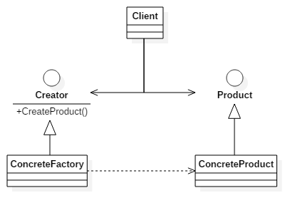
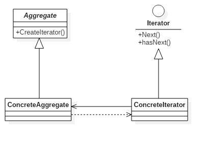

### 创建型模式

#### 单例模式 Singleton

单例类是指仅有一个实例的类。在系统中具有惟一性的组件可作为单例类，这种类的实例通常会占用较多的内存，或者实例的初始化过程比较冗长，因此随意创建这些类的实例会影响系统的性能。


```java
public class SingletonClass{
    private static SingletonClass instance=null;
    public static SingletonClass getInstance(){
        if(instance==null){
            synchronized(SingletonClass.class){
                if(instance==null){
                    instance=new SingletonClass();
                }
            }
        }
        return instance;
    }
    private SingletonClass(){}
}
```
**特点**：
1. 某个类只能有一个实例，单例模式的类只提供私有的构造函数
2. 它必须自行创建这个实例，类定义中含有一个该类的静态私有对象
3. 它必须自行向整个系统提供这个实例，该类提供了一个静态的公有的函数用于创建或获取它本身的静态私有对象。


#### 原型模式 Prototype

用原型实例指定创建对象的种类，并通过拷贝这些原型创建新的对象。原型模式主要用于对象的复制。


```java
class Prototype implements Cloneable {  
    public Prototype clone(){  
        Prototype prototype = null;  
        try{  
            prototype = (Prototype)super.clone();  
        }catch(CloneNotSupportedException e){  
            e.printStackTrace();  
        }  
        return prototype;   
    }  
}  

class ConcretePrototype extends Prototype{  
    public void show(){  
        System.out.println("原型模式实现类");  
    }  
}  

public class Client {  
    public static void main(String[] args){  
        ConcretePrototype cp = new ConcretePrototype();  
        for(int i=0; i< 10; i++){  
            ConcretePrototype clonecp = (ConcretePrototype)cp.clone();  
            clonecp.show();  
        }  
    }  
}  
```
**特点**：

1. 使用原型模式创建对象比直接new一个对象在性能上要好的多，因为Object类的clone方法是一个本地方法，它直接操作内存中的二进制流，特别是复制大对象时，性能的差别非常明显。
2. 使用原型模式的另一个好处是简化对象的创建，使得创建对象就像我们在编辑文档时的复制粘贴一样简单。

**注意**：

1. 使用原型模式复制对象不会调用类的构造方法。所以，单例模式与原型模式是冲突的。
2. Object类的clone方法只会拷贝对象中的基本的数据类型，对于数组、容器对象、引用对象等都不会拷贝。原型模式中的数组、容器对象、引用对象等要另行拷贝。

```java
ublic class Prototype implements Cloneable {  
    private ArrayList list = new ArrayList();  
    public Prototype clone(){  
        Prototype prototype = null;  
        try{  
            prototype = (Prototype)super.clone();  
            prototype.list = (ArrayList) this.list.clone();  // 私有的数组手动拷贝
        }catch(CloneNotSupportedException e){  
            e.printStackTrace();  
        }  
        return prototype;   
    }  
}  
```

#### 建造者模式 Builder

将一个复杂对象的构建与它的表示分离，使得同样的构建过程可以创建不同的表示。建造模式是将复杂的内部创建封装在内部，对于外部调用的人来说，只需要传入建造者和建造工具，对于内部是如何建造成成品的，调用者无需关心。


1. Builder：给出一个抽象接口，以规范产品对象的各个组成成分的建造。这个接口规定要实现复杂对象的哪些部分的创建，并不涉及具体的对象部件的创建。
2. ConcreteBuilder：实现Builder接口，针对不同的商业逻辑，具体化复杂对象的各部分的创建。 在建造过程完成后，提供产品的实例。
3. Director：调用具体建造者来创建复杂对象的各个部分，在指导者中不涉及具体产品的信息，只负责保证对象各部分完整创建或按某种顺序创建。
4. Product：要创建的复杂对象。

```java
interface Builder {
    Product getProduct();
    void setPart(String arg1, String arg2);
}

//具体建造工具
class ConcreteBuilder implements Builder {
    private Product product = new Product();
    @Override
    public Product getProduct() {
        return product;
    }
    @Override
    public void setPart(String arg1, String arg2) {
        product.setName(arg1);
        product.setType(arg2);
    }
}

//建造者
class Director {
    private Builder builder = new ConcreteBuilder();

    public Product getProduct(){
        builder.setPart("AAA","BBB");
        return builder.getProduct();
    }
}


class Product {
    private String name;
    private String type;
    public void showProduct(){
        System.out.println("名称："+name);
        System.out.println("型号："+type);
    }

    public void setName(String name) {
        this.name = name;
    }

    public void setType(String type) {
        this.type = type;
    }
}

public class Client {
    public static void main(String[] args){
        Director director = new Director();
        Product product1 = director.getProduct();
        product1.showProduct();
    }
}
```

**特点**：

1. 建造者模式的封装性很好。使用建造者模式可以有效的封装变化，在使用建造者模式的场景中，一般产品类和建造者类是比较稳定的，因此，将主要的业务逻辑封装在导演类中对整体而言可以取得比较好的稳定性。
2. 建造者模式很容易进行扩展。如果有新的需求，通过实现一个新的建造者类就可以完成，基本上不用修改之前已经测试通过的代码，因此也就不会对原有功能引入风险。

#### 工厂方法模式 Factory Method

定义一个用于创建对象的接口，让子类决定实例化哪一个类，工厂方法使一个类的实例化延迟到其子类。工厂模式是编程中经常用到的一种模式，工厂模式根据抽象程度的不同分为三种：
1. 简单工厂模式（静态工厂模式）
2. 工厂方法模式（当前介绍的模式）
3. 抽象工厂模式（[下一节介绍](#抽象工厂模式-Abstract-Factory)）


**特点**：

不管是简单工厂模式，工厂方法模式还是抽象工厂模式，他们具有类似的特性，所以他们的适用场景也是类似的：
1. 作为一种创建类模式，在任何需要生成复杂对象的地方，都可以使用工厂方法模式。
2. 调用者自己组装产品需要增加依赖关系时，可以考虑使用工厂模式。将会大大降低对象之间的耦合度。
3. 当需要系统有比较好的扩展性时，可以考虑工厂模式，不同的产品用不同的实现工厂来组装。

**注意**： 复杂对象适合使用工厂模式，而简单对象，特别是只需要通过new就可以完成创建的对象，无需使用工厂模式。如果使用工厂模式，就需要引入一个工厂类，会增加系统的复杂度。


```java
interface Product {
    public void productMethod();
}
interface Creator {
    public Product createProduct();
}

class ConcreteProduct implements Product {
    public void productMethod() {
        System.out.println("产品");
    }
}

class Factory implements Creator {
    public ConcreteProduct createProduct() {
        return new ConcreteProduct();
    }
}

public class Client {
    public static void main(String[] args) {
        Factory factory = new Factory();
        ConcreteProduct prodect = factory.createProduct();
        prodect.productMethod();
    }
}
```


#### 抽象工厂模式 Abstract Factory

为创建一组相关或相互依赖的对象提供一个接口，而且无需指定他们的具体类。抽象工厂模式用来创建一组相关或者相互依赖的对象。他与工厂方法模式的区别就在于，工厂方法模式针对的是一个产品等级结构；而抽象工厂模式则是针对的多个产品等级结构。在编程中，通常一个产品结构，表现为一个接口或者抽象类，也就是说，工厂方法模式提供的所有产品都是衍生自同一个接口或抽象类，而抽象工厂模式所提供的产品则是衍生自不同的接口或抽象类。



```java
interface Product1 {
    public void show();
}
interface Product2 {
    public void show();
}
interface Creator {
    public Product1 createProduct1();
    public Product2 createProduct2();
}

class ConcreteProduct1 implements Product1 {
    public void show() {
        System.out.println("这是1型产品");
    }
}

class ConcreteProduct2 implements Product2 {
    public void show() {
        System.out.println("这是2型产品");
    }
}

class Factory implements Creator{
    public Product1 createProduct1() {
        return new ConcreteProduct1();
    }
    public Product2 createProduct2() {
        return new ConcreteProduct2();
    }
}

public class Client {
    public static void main(String[] args){
        Creator factory = new Factory();
        factory.createProduct1().show();
        factory.createProduct2().show();
    }
}
```
**特点**：
抽象工厂模式除了工厂模式共有特点外，独特的优点就是可以在类的内部对产品族进行约束。所谓的产品族，一般或多或少的都存在一定的关联，抽象工厂模式就可以在类内部对产品族的关联关系进行定义和描述，而不必专门引入一个新的类来进行管理。

#### 创建类模式总结

创建类模式主要关注对象的创建过程，将对象的创建过程进行封装，使客户端可以直接得到对象，而不用去关心如何创建对象。创建类模式好处：

1.  降低了对象间的耦合，提高了对象复用的可能。（缺点是组装类的任务都交给了最终调用的客户端程序，增加了客户端程序的复杂度）
2.  创建类模式实现面向抽象编程。客户端要求的只是一个抽象的类型，具体返回什么样的对象，由创建者来决定。
3.  创建者可以对创建的过程进行优化，具有优化系统性能的功能

### 结构型模式

#### 适配器模式 Adapter

适配器模式是将一个类的接口转换成客户希望的另外一个接口。适配器模式使得原本由于接口不兼容而不能一起工作的那些类可以一起工作。
两个成熟的类需要通信，但是接口不同，由于开闭原则，我们不能去修改这两个类的接口，所以就需要一个适配器来完成衔接过程。


```java
abstract class Target {
    abstract void Request();
}

class Adaptee {
    public void SpecificRequest() {
        System.out.print("特殊请求");
    }
}

class Adapter extends Target {
    private Adaptee adaptee = new Adaptee();

    public void Request() {
        adaptee.SpecificRequest();
    }
}

public class Client {
    public static void main(String[] args){
        Target target = new Adapter();
        target.Request();
    }
}
```

#### 桥接模式 Bridge

桥接模式将抽象部分与它的实现部分分离，是它们都可以独立地变化。它很好的支持了开闭原则和组合锯和复用原则。实现系统可能有多角度分类，每一种分类都有可能变化，那么就把这些多角度分离出来让他们独立变化，减少他们之间的耦合。


```java
interface Phone{
    void on();
    void off();
    String getMessage();
    void weibo(String string);
}
abstract class Human{
    private Phone phone;

    public void buyPhone(Phone phone) {
        this.phone = phone;
    }

    public void phoneTurnOn(){
        phone.on();
    }

    public void phoneTurnOff(){
        phone.off();
    }

    public void readMessage(){
        System.out.print(phone.getMessage());
    }
}
class IPhone7 implements Phone{

    @Override
    public void on() {
        System.out.print("IPhone开机\n");
    }

    @Override
    public void off() {
        System.out.print("IPhone关机\n");
    }

    @Override
    public String getMessage() {
        return "IPhone有一条消息\n";
    }

    @Override
    public void weibo(String string) {
        System.out.print(string + " -来自iPhone7\n");
    }
}
class SamsungNote7 implements Phone{

    @Override
    public void on() {
        System.out.print("SamsungNote7开机\n");
    }

    @Override
    public void off() {
        System.out.print("SamsungNote7关机\n");
    }

    @Override
    public String getMessage() {
        return "SamsungNote7有一条消息\n";
    }

    @Override
    public void weibo(String string) {
        System.out.print(string + " -来自SamsungNote7\n");
    }
}

class Woman extends Human{
    @Override
    public void buyPhone(Phone phone) {
        super.buyPhone(phone);
        phone.weibo("我买了新手机");
    }
}

public class Client{
    public static void main(String args[]){
        Human Angela = new Woman();
        Human Limei = new Woman();
        Angela.buyPhone(new IPhone7());
        Limei.buyPhone(new SamsungNote7());
        Angela.phoneTurnOff();
        Limei.phoneTurnOn();
        Limei.readMessage();
        Limei.phoneTurnOff();
    }
}
```

#### 组合模式 Composite

组合模式将对象组合成树形结构以表示部分-整体的层次结构，组合模式使得用户对单个对象和组合对象的使用具有一致性。


#### 装饰模式 Decorator

装饰模式动态地给一个对象添加一些额外的职责，就增加功能来说，它比生成子类更灵活。也可以这样说，装饰模式把复杂类中的核心职责和装饰功能区分开了，这样既简化了复杂类，有去除了相关类中重复的装饰逻辑。 **装饰模式没有通过继承原有类来扩展功能，但却达到了一样的目的，而且比继承更加灵活，所以可以说装饰模式是继承关系的一种替代方案**。


#### 外观模式 Facade

外观模式为子系统中的一组接口提供了同意的界面，外观模式定义了一个高层接口，这个接口使得这一子系统更加容易使用。
外观模式中，客户对各个具体的子系统是不了解的，所以对这些子系统进行了封装，对外只提供了用户所明白的单一而简单的接口，用户直接使用这个接口就可以完成操作，而不用去理睬具体的过程，而且子系统的变化不会影响到用户，这样就做到了信息隐蔽。


#### 享元模式 Flyweight

享元模式为运用共享技术有效的支持大量细粒度的对象。因为它可以通过共享大幅度地减少单个实例的数目，避免了大量非常相似类的开销。
享元模式是一个类别的多个对象共享这个类别的一个对象，而不是各自再实例化各自的对象。这样就达到了节省内存的目的。


#### 代理模式 Proxy   

为其他对象提供一种代理，并由代理对象控制对原对象的引用，以间接控制对原对象的访问。


### 行为型模式

#### 迭代器模式 Iterator

提供一种方法访问一个容器对象中各个元素，而又不暴露该对象的内部细节。迭代器模式是java中使用最多的一种模式, 迭代器模式是与集合结合的，一般来说，我们只要实现一个集合，就需要同时提供这个集合的迭代器，就像java中的Collection，List、Set、Map等，这些集合都有自己的迭代器。



```java
interface Iterator {
     Object next();
     boolean hasNext();
}
class ConcreteIterator implements Iterator{
    private List list = new ArrayList();
    private int cursor =0;
    public ConcreteIterator(List list){
        this.list = list;
    }
    public boolean hasNext() {
        if(cursor==list.size()){
            return false;
        }
        return true;
    }
    public Object next() {
        Object obj = null;
        if(this.hasNext()){
            obj = this.list.get(cursor++);
        }
        return obj;
    }
}
abstract class Aggregate {
    abstract void add(Object obj);
    abstract Iterator iterator();
}
class ConcreteAggregate extends Aggregate {
    private List list = new ArrayList();
    public void add(Object obj) {
        list.add(obj);
    }

    public Iterator iterator() {
        return new ConcreteIterator(list);
    }
}
public class Client {
    public static void main(String[] args){
        Aggregate ag = new ConcreteAggregate();
        ag.add("小明");
        ag.add("小红");
        ag.add("小刚");
        Iterator it = ag.iterator();
        while(it.hasNext()){
            String str = (String)it.next();
            System.out.println(str);
        }
    }
}
```

**特点**：
1. 简化了遍历方式，对于hash表等复杂的情况，引入了迭代器方法，用户用起来就简单的多了。（但简单的遍历（像数组或者有序列表），使用迭代器方式遍历较为繁琐）
2. 可以提供多种遍历方式，比如说对有序列表，我们可以根据需要提供正序遍历，倒序遍历两种迭代器，只需要实现好的迭代器，就可以方便的对集合进行遍历了。
3. 封装性良好，用户只需要得到迭代器就可以遍历，而对于遍历算法则不用去关心。

#### 解释器模式 Interpreter

给定一种语言，定义他的文法的一种表示，并定义一个解释器，该解释器使用该表示来解释语言中句子。解释器模式是一个比较少用的模式，因为维护他太麻烦，也会引起效率、性能以及维护等问题。


```java
class Context {}
abstract class Expression {
    public abstract Object interpreter(Context ctx);
}
class TerminalExpression extends Expression {
    public Object interpreter(Context ctx){
        return null;
    }
}
class NonterminalExpression extends Expression {
    public NonterminalExpression(Expression expressions){

    }
    public Object interpreter(Context ctx){
        return null;
    }
}
public class Client {
    public static void main(String[] args){
        String expression = "";
        char[] charArray = expression.toCharArray();
        Context ctx = new Context();
        Stack<Expression> stack = new Stack<Expression>();
        for(int i=0;i<charArray.length;i++){
            //根据实际情况进行语法判断，递归调用
        }
        Expression exp = stack.pop();
        exp.interpreter(ctx);
    }
}
```
这一段为**伪代码**，解释器是一个简单的语法分析工具，它最显著的优点就是扩展性，修改语法规则只需要修改相应的`NonterminalExpression`就可以了，若扩展语法，只需要`NonterminalExpression`就可以了。
解释器模式每个语法都需要产生一个`NonterminalExpression`，语法规则比较复杂时，就可能产生大量的类文件，为维护带来非常多的麻烦。由于采用递归调用方法，每个`NonterminalExpression`只关心与自己相关的表达式，每个表达式需要知道最终的结果，必须通过递归方式，无论是面向对象的语言还是面向过程的语言，递归都是一个不推荐的方式。由于使用了大量的循环和递归，效率是一个不容忽视的问题。特别是用于解释一个解析复杂、冗长的语法时，效率是难以忍受的。

#### 观察者模式 Observer

观察者模式定义了一种一对多的依赖关系，让多个观察者对象同时监听某一个对象。这个对象在状态上发生变化时，会通知所有观察者对象，让它们能够自动更新自己。  观察者与被观察者之间是属于轻度的关联关系，并且是抽象耦合的，这样，对于两者来说都比较容易进行扩展。


```java
abstract class Subject {
    private Vector<Observer> obs = new Vector<Observer>();

    public void addObserver(Observer obs){
        this.obs.add(obs);
    }
    public void delObserver(Observer obs){
        this.obs.remove(obs);
    }
    protected void notifyObserver(){
        for(Observer o: obs){
            o.update();
        }
    }
    public abstract void doSomething();
}

class ConcreteSubject extends Subject {
    public void doSomething(){
        System.out.println("被观察者事件反生");
        this.notifyObserver();
    }
}
interface Observer {
    public void update();
}
class ConcreteObserver1 implements Observer {
    public void update() {
        System.out.println("观察者1收到信息，并进行处理。");
    }
}
class ConcreteObserver2 implements Observer {
    public void update() {
        System.out.println("观察者2收到信息，并进行处理。");
    }
}

public class Client {
    public static void main(String[] args){
        Subject sub = new ConcreteSubject();
        sub.addObserver(new ConcreteObserver1()); //添加观察者1
        sub.addObserver(new ConcreteObserver2()); //添加观察者2
        sub.doSomething();
    }
}
```
可以看出，我们只调用了Subject的方法，但同时两个观察者的相关方法都被同时调用了。仔细看一下代码，就是在Subject类中关联一下Observer类，并且在doSomething方法中遍历一下Observer的update方法就行了。

 java语言中，有一个接口Observer，以及它的实现类Observable，对观察者角色常进行了实现。我们可以在jdk的api文档具体查看这两个类的使用方法。

#### 中介者模式 Mediator

中介者模式又称为**调停者模式**,用一个中介者对象封装一系列的对象交互，中介者使各对象不需要显示地相互作用，从而使耦合松散，而且可以独立地改变它们之间的交互。


```java
abstract class AbstractColleague {
    int number;

    int getNumber() {
        return number;
    }

    void setNumber(int number){
        this.number = number;
    }

    public abstract void setNumber(int number, AbstractMediator am);
}

class ColleagueA extends AbstractColleague{
    @Override
    public void setNumber(int number, AbstractMediator am) {
        this.number = number;
        am.AaffectB();
    }
}

class ColleagueB extends AbstractColleague{

    @Override
    public void setNumber(int number, AbstractMediator am) {
        this.number = number;
        am.BaffectA();
    }
}

abstract class AbstractMediator {
    AbstractColleague A;
    AbstractColleague B;

    AbstractMediator(AbstractColleague a, AbstractColleague b) {
        A = a;
        B = b;
    }

    public abstract void AaffectB();

    public abstract void BaffectA();

}
class Mediator extends AbstractMediator {

    Mediator(AbstractColleague a, AbstractColleague b) {
        super(a, b);
    }

    //处理A对B的影响
    public void AaffectB() {
        int number = A.getNumber();
        B.setNumber(number*100);
    }

    //处理B对A的影响
    public void BaffectA() {
        int number = B.getNumber();
        A.setNumber(number/100);
    }
}

public class Client {
    public static void main(String[] args){
        AbstractColleague collA = new ColleagueA();
        AbstractColleague collB = new ColleagueB();

        AbstractMediator am = new Mediator(collA, collB);

        System.out.println("==========通过设置A影响B==========");
        collA.setNumber(1000, am);
        System.out.println("collA的number值为："+collA.getNumber());
        System.out.println("collB的number值为A的10倍："+collB.getNumber());

        System.out.println("==========通过设置B影响A==========");
        collB.setNumber(1000, am);
        System.out.println("collB的number值为："+collB.getNumber());
        System.out.println("collA的number值为B的0.1倍："+collA.getNumber());

    }
}
```
这段代码其实就是把原来处理对象关系的代码重新封装到一个中介类中，通过这个中介类来处理对象间的关系。

**特点**：
1. 适当地使用中介者模式可以避免同事类之间的过度耦合，使得各同事类之间可以相对独立地使用。
2. 使用中介者模式可以将对象间一对多的关联转变为一对一的关联，使对象间的关系易于理解和维护。
3. 使用中介者模式可以将对象的行为和协作进行抽象，能够比较灵活的处理对象间的相互作用。

#### 访问者模式 Visitor

封装某些作用于某种数据结构中各元素的操作，它可以在不改变数据结构的前提下定义作用于这些元素的新的操作。 访问者模式可能是行为类模式中最复杂的一种模式。


```java
abstract class Element {
    public abstract void accept(Visitor visitor);
    public abstract void doSomething();
}

abstract class Visitor {
    abstract void visit(ConcreteElement1 el1);
    abstract void visit(ConcreteElement2 el2);
}

class ConcreteElement1 extends Element {
    public void doSomething(){
        System.out.println("这是元素1");
    }

    public void accept(Visitor visitor) {
        visitor.visit(this);
    }
}

class ConcreteElement2 extends Element {
    public void doSomething(){
        System.out.println("这是元素2");
    }

    public void accept(Visitor visitor) {
        visitor.visit(this);
    }
}
class ConcreteVisitor extends Visitor {

    public void visit(ConcreteElement1 el1) {
        el1.doSomething();
    }

    public void visit(ConcreteElement2 el2) {
        el2.doSomething();
    }
}

class ObjectStruture {
    public static List<Element> getList() {
        List<Element> list = new ArrayList<Element>();
        Random ran = new Random();
        for(int i = 0; i < 10; i++){
            int a = ran.nextInt(100);
            if(a > 50) {
                list.add(new ConcreteElement1());
            } else {
                list.add(new ConcreteElement2());
            }
        }
        return list;
    }
}

public class Client {
    public static void main(String[] args){
        List<Element> list = ObjectStruture.getList();
        for(Element e: list){
            e.accept(new ConcreteVisitor());
        }
    }
}
```
方便理解可以简化为

```java
class Element {
    public void doSomething(){
        System.out.println("我是元素");
    }

    public void accept(Visitor visitor){
        visitor.visit(this);
    }
}

class Visitor {
    public void visit(Element el){
        el.doSomething();
    }
}
public class Client {
    public static void main(String[] args){
        Element el = new Element();
        el.accept(new Visitor());
    }
}  
```


**特点**
1. 符合单一职责原则：元素类中封装在访问者中的操作必定是与元素类本身关系不大且是易变的操作。被封装的操作通常都是易变的，当发生变化时，在不改变元素类本身的前提下，实现对变化部分的扩展。
2. 扩展性良好：元素类可以通过接受不同的访问者来实现对不同操作的扩展。

#### 备忘录模式 Memento

在不破坏封装性的前提下，捕获一个对象的内部状态，并在该对象之外保存这个状态。这样就可以将该对象恢复到原先保存的状态。


**特点**：
1. 当发起人角色中的状态改变时，为对象保存一个备份，当改变是错误时，就可以恢复对象。
2. 备份的状态是保存在发起人角色之外的，发起人角色就不需要对各个备份的状态进行管理。

#### 状态模式 State

当一个对象的内在状态改变时允许改变其行为，这个对象看起来像是改变了其类。当一个对象的行为取决于它的状态，并且它必须在运行时刻根据状态改变它的行为时，就可以考虑使用状态模式来。


```java
abstract class State {
    public abstract void Handle(Context context);
}

class Context {
    private State state;

    public Context(State state) {
        this.state = state;
    }

    public void setState(State state) {
        this.state = state;
    }

    public void Request() {
        state.Handle(this);
    }
}

class ConcreteStateA extends State {
    @Override
    public  void Handle(Context context) {
        System.out.println("当前状态是 A.");
        context.setState(new ConcreteStateB());
    }
}

class ConcreteStateB extends State {
    @Override
    public  void Handle(Context context) {
        System.out.println("当前状态是 B.");
        context.setState(new ConcreteStateA());
    }
}

public class Client{
    public static void main(String args[]){
        Context context = new Context(new ConcreteStateA());
        context.Request();
        context.Request();
        context.Request();
        context.Request();
    }
}
```

**特点**：
1. 状态模式将与特定状态相关的行为局部化，并且将不同状态的行为分割开来。
2. 所有状态相关的代码都存在于某个ConcereteState中，所以通过定义新的子类很容易地增加新的状态和转换。
3. 状态模式通过把各种状态转移逻辑分不到State的子类之间，来减少相互间的依赖。

#### 模版方法模式 Template Method

定义一个操作中的算法的骨架，而将步骤延迟到子类中。模板方法使得子类可以不改变一个算法的结构即可重定义算法的某些特定步骤。


```java
abstract class AbstractClass{
    abstract void PrimitiveOperation1();
    abstract void PrimitiveOperation2();

    public void TemplateMethod() {
        PrimitiveOperation1();
        PrimitiveOperation2();
        System.out.println("方法完成");
    }
}

class ConcreteClassA extends AbstractClass{
    @Override
    public void PrimitiveOperation1() {
        System.out.println("ConcreteClassA中实现Operation1");
    }

    @Override
    public void PrimitiveOperation2() {
        System.out.println("ConcreteClassA中实现Operation2");
    }
}

class ConcreteClassB extends AbstractClass{
    @Override
    public void PrimitiveOperation1() {
        System.out.println("ConcreteClassB中实现Operation1");
    }

    @Override
    public void PrimitiveOperation2() {
        System.out.println("ConcreteClassB中实现Operation2");
    }
}

public class Client{
    public static void main(String args[]){
        AbstractClass c;

        // 用ConcreteClassA实例化c
        c = new ConcreteClassA();
        c.TemplateMethod();

        // 用ConcreteClassB实例化c
        c = new ConcreteClassB();
        c.TemplateMethod();
    }
}
```

**特点**：
1. 模板方法模式通过把不变的行为搬移到超类，去除了子类中的重复代码。
2. 子类实现算法的某些细节，有助于算法的扩展。（但是不同的实现都需要定义一个子类，这会导致类的个数的增加，设计更加抽象）
3. 通过一个父类调用子类实现的操作，通过子类扩展增加新的行为，符合“开放-封闭”原则。

#### 策略模式 Strategy

定义一组算法，将每个算法都封装起来，并且使他们之间可以互换。策略模式是对算法的封装，把一系列的算法分别封装到对应的类中，并且这些类实现相同的接口，相互之间可以替换。策略模式与模版方法模式的区别仅仅是多了一个单独的封装类Context。


```java
interface Strategy {
    void doSomething();
}
class ConcreteStrategy implements Strategy {
    public void doSomething() {
        System.out.println("具体策略1");
    }
}
class Context {
    private Strategy strategy;

    public Context(Strategy strategy){
        this.strategy = strategy;
    }

    public void execute(){
        strategy.doSomething();
    }
}

public class Client {
    public static void main(String[] args){
        Context context;
        System.out.println("-----执行策略-----");
        context = new Context(new ConcreteStrategy());
        context.execute();
    }
}
```

**特点**：
1. 策略类之间可以自由切换，由于策略类实现自同一个抽象，所以他们之间可以自由切换。
2. 易于扩展，增加一个新的策略对策略模式来说非常容易，基本上可以在不改变原有代码的基础上进行扩展。
3. 避免使用多重条件，如果不使用策略模式，所有的算法必须使用条件语句进行连接，通过条件判断来决定使用哪一种算法。

#### 命令模式 Command

将一个请求封装成一个对象，从而让你使用不同的请求把客户端参数化，对请求排队或者记录请求日志，可以提供命令的撤销和恢复功能。命令模式就是对命令的封装。


```java
abstract class Command {
    public abstract void execute();
}

class Receiver {
    void doSomething(){
        System.out.println("接受者-业务逻辑处理");
    }
}

class Invoker {
    private Command command;
    void setCommand(Command command) {
        this.command = command;
    }
    void action(){
        this.command.execute();
    }
}

class ConcreteCommand extends Command {
    private Receiver receiver;
    ConcreteCommand(Receiver receiver){
        this.receiver = receiver;
    }
    public void execute() {
        this.receiver.doSomething();
    }
}


public class Client {
    public static void main(String[] args){
        Receiver receiver = new Receiver();
        Command command = new ConcreteCommand(receiver);
        //客户端直接执行具体命令方式（此方式与类图相符）
        command.execute();

        //客户端通过调用者来执行命令
        Invoker invoker = new Invoker();
        invoker.setCommand(command);
        invoker.action();
    }
}
```
**特点**：
1. 命令模式的封装性很好，客户端来需要什么功能就去调用相应的命令，无需知道命令具体是怎么执行的。（无论命令多简单，都需要一个命令类来封装，比较繁琐）
2. 命令模式的扩展性很好。比如，文件的操作中，我们需要增加一个剪切文件的命令，则只需要把复制文件和删除文件这两个命令组合一下就行了，非常方便。

#### 职责链模式 Chain of Responsibility

使多个对象都有机会处理请求，从而避免了请求的发送者和接收者之间的耦合关系。将这些对象连成一条链，并沿着这条链传递该请求，直到有对象处理它为止。
责任链模式与if…else…相比，他的耦合性要低一些，因为它把条件判定都分散到了各个处理类中，并且这些处理类的优先处理顺序可以随意设定。责任链模式也有缺点，这与if…else…语句的缺点是一样的，那就是在找到正确的处理类之前，所有的判定条件都要被执行一遍，当责任链比较长时，性能问题比较严重。


```java
class Level {
    private int level = 0;
    Level(int level){
        this.level = level;
    }

    boolean above(Level level){
        return this.level >= level.level;
    }
}

class Request {
    private Level level;
    Request(Level level){
        this.level = level;
    }

    Level getLevel(){
        return level;
    }
}

class Response {

}

abstract class Handler {
    private Handler nextHandler;
    final Response handleRequest(Request request){
        Response response = null;

        if(this.getHandlerLevel().above(request.getLevel())){
            response = this.response(request);
        }else{
            if(this.nextHandler != null){
                this.nextHandler.handleRequest(request);
            }else{
                System.out.println("-----没有合适的处理器-----");
            }
        }
        return response;
    }
    void setNextHandler(Handler handler){
        this.nextHandler = handler;
    }
    protected abstract Level getHandlerLevel();
    public abstract Response response(Request request);
}

class ConcreteHandler1 extends Handler {
    protected Level getHandlerLevel() {
        return new Level(1);
    }
    public Response response(Request request) {
        System.out.println("-----请求由处理器1进行处理-----");
        return null;
    }
}

class ConcreteHandler2 extends Handler {
    protected Level getHandlerLevel() {
        return new Level(3);
    }
    public Response response(Request request) {
        System.out.println("-----请求由处理器2进行处理-----");
        return null;
    }
}

class ConcreteHandler3 extends Handler {
    protected Level getHandlerLevel() {
        return new Level(5);
    }
    public Response response(Request request) {
        System.out.println("-----请求由处理器3进行处理-----");
        return null;
    }
}

public class Client {
    public static void main(String[] args){
        Handler handler1 = new ConcreteHandler1();
        Handler handler2 = new ConcreteHandler2();
        Handler handler3 = new ConcreteHandler3();

        handler1.setNextHandler(handler2);
        handler2.setNextHandler(handler3);

        Response response = handler1.handleRequest(new Request(new Level(4)));
    }
}
```
