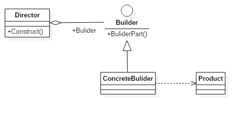
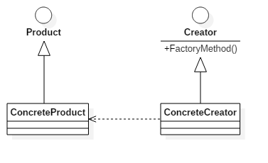
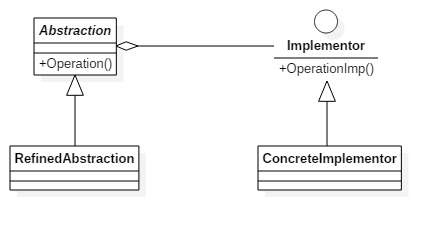

#### 创建型模式

##### 单例模式 Singleton

单例类是指仅有一个实例的类。在系统中具有惟一性的组件可作为单例类，这种类的实例通常会占用较多的内存，或者实例的初始化过程比较冗长，因此随意创建这些类的实例会影响系统的性能。


```java
public class SingletonClass{
    private static SingletonClass instance=null;
    public static SingletonClass getInstance(){
        if(instance==null){
            synchronized(SingletonClass.class){
                if(instance==null){
                    instance=new SingletonClass();
                }
            }
        }
        return instance;
    }
    private SingletonClass(){}
}
```
**特点**：
1. 某个类只能有一个实例，单例模式的类只提供私有的构造函数
2. 它必须自行创建这个实例，类定义中含有一个该类的静态私有对象
3. 它必须自行向整个系统提供这个实例，该类提供了一个静态的公有的函数用于创建或获取它本身的静态私有对象。


##### 原型模式 Prototype

用原型实例指定创建对象的种类，并通过拷贝这些原型创建新的对象。原型模式主要用于对象的复制。


```java
class Prototype implements Cloneable {  
    public Prototype clone(){  
        Prototype prototype = null;  
        try{  
            prototype = (Prototype)super.clone();  
        }catch(CloneNotSupportedException e){  
            e.printStackTrace();  
        }  
        return prototype;   
    }  
}  

class ConcretePrototype extends Prototype{  
    public void show(){  
        System.out.println("原型模式实现类");  
    }  
}  

public class Client {  
    public static void main(String[] args){  
        ConcretePrototype cp = new ConcretePrototype();  
        for(int i=0; i< 10; i++){  
            ConcretePrototype clonecp = (ConcretePrototype)cp.clone();  
            clonecp.show();  
        }  
    }  
}  
```
**特点**：

1. 使用原型模式创建对象比直接new一个对象在性能上要好的多，因为Object类的clone方法是一个本地方法，它直接操作内存中的二进制流，特别是复制大对象时，性能的差别非常明显。
2. 使用原型模式的另一个好处是简化对象的创建，使得创建对象就像我们在编辑文档时的复制粘贴一样简单。

**注意**：

1. 使用原型模式复制对象不会调用类的构造方法。所以，单例模式与原型模式是冲突的。
2. Object类的clone方法只会拷贝对象中的基本的数据类型，对于数组、容器对象、引用对象等都不会拷贝。原型模式中的数组、容器对象、引用对象等要另行拷贝。

```java
ublic class Prototype implements Cloneable {  
    private ArrayList list = new ArrayList();  
    public Prototype clone(){  
        Prototype prototype = null;  
        try{  
            prototype = (Prototype)super.clone();  
            prototype.list = (ArrayList) this.list.clone();  // 私有的数组手动拷贝
        }catch(CloneNotSupportedException e){  
            e.printStackTrace();  
        }  
        return prototype;   
    }  
}  
```

##### 建造者模式 Builder

将一个复杂对象的构建与它的表示分离，使得同样的构建过程可以创建不同的表示。建造模式是将复杂的内部创建封装在内部，对于外部调用的人来说，只需要传入建造者和建造工具，对于内部是如何建造成成品的，调用者无需关心。



##### 工厂模式 Factory Method



##### 抽象工厂模式 Abstract Factory


#### 结构型模式

##### 适配器模式 Adapter

适配器模式是将一个类的接口转换成客户希望的另外一个接口。适配器模式使得原本由于接口不兼容而不能一起工作的那些类可以一起工作。
两个成熟的类需要通信，但是接口不同，由于开闭原则，我们不能去修改这两个类的接口，所以就需要一个适配器来完成衔接过程。


##### 桥接模式 Bridge

桥接模式将抽象部分与它的实现部分分离，是它们都可以独立地变化。它很好的支持了开闭原则和组合锯和复用原则。实现系统可能有多角度分类，每一种分类都有可能变化，那么就把这些多角度分离出来让他们独立变化，减少他们之间的耦合。



##### 组合模式 Composite

组合模式将对象组合成树形结构以表示部分-整体的层次结构，组合模式使得用户对单个对象和组合对象的使用具有一致性。


##### 装饰模式 Decorator

装饰模式动态地给一个对象添加一些额外的职责，就增加功能来说，它比生成子类更灵活。也可以这样说，装饰模式把复杂类中的核心职责和装饰功能区分开了，这样既简化了复杂类，有去除了相关类中重复的装饰逻辑。 **装饰模式没有通过继承原有类来扩展功能，但却达到了一样的目的，而且比继承更加灵活，所以可以说装饰模式是继承关系的一种替代方案**。


##### 外观模式 Facade

外观模式为子系统中的一组接口提供了同意的界面，外观模式定义了一个高层接口，这个接口使得这一子系统更加容易使用。
外观模式中，客户对各个具体的子系统是不了解的，所以对这些子系统进行了封装，对外只提供了用户所明白的单一而简单的接口，用户直接使用这个接口就可以完成操作，而不用去理睬具体的过程，而且子系统的变化不会影响到用户，这样就做到了信息隐蔽。


##### 享元模式 Flyweight

享元模式为运用共享技术有效的支持大量细粒度的对象。因为它可以通过共享大幅度地减少单个实例的数目，避免了大量非常相似类的开销。
享元模式是一个类别的多个对象共享这个类别的一个对象，而不是各自再实例化各自的对象。这样就达到了节省内存的目的。


##### 代理模式 Proxy   

为其他对象提供一种代理，并由代理对象控制对原对象的引用，以间接控制对原对象的访问。


#### 行为型模式

##### 迭代器模式 Iterator


##### 解释器模式 Interpreter


##### 观察者模式 Observer


##### 中介者模式 Mediator


##### 访问者模式 Visitor


##### 备忘录模式 Memento


##### 状态模式 State


##### 策略模式 Strategy


##### 模版方法模式 Template Method


##### 命令模式 Command


##### 职责链模式 Chain of Responsibility


