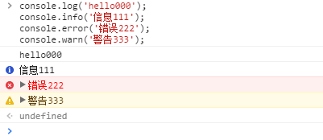
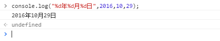
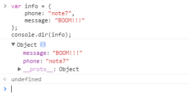
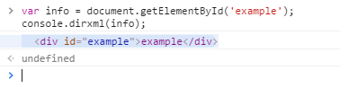
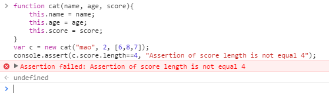
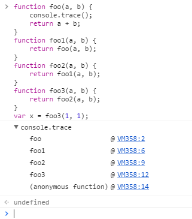
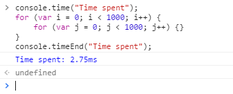
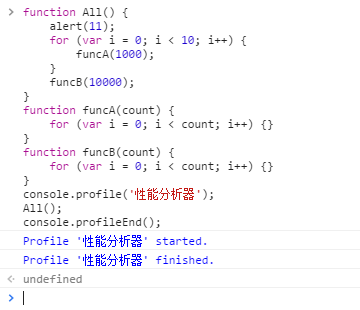
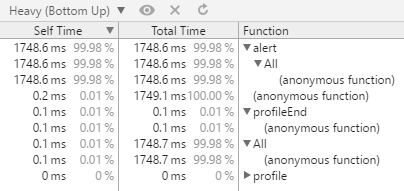
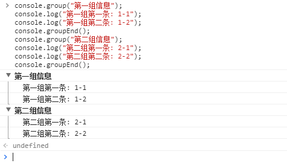

# console显示信息

本文使用 Chrome 浏览器中 Developer Tools来演示各种效果

## 显示信息

console 提供了不同级别的消息显示方法

```javascript
console.log('hello000');
console.info('信息111');
console.error('错误222');
console.warn('警告333');
```



## 使用占位符

console也支持占位符格式，支持的占位符有：字符（%s）、整数（%d或%i）、浮点数（%f）和对象（%o）。

```javascript
console.log("%d年%d月%d日",2016,10,29);
```



## console查看对象的信息

console.dir()可以显示一个对象所有的属性和方法

```javascript
var info = {
    phone: "note7",
    message: "BOOM!!!"
};
console.dir(info);
```



## console显示某个节点的内容

用console.dirxml()用来显示网页的某个节点（node）所包含的html/xml代码。

```html
<!DOCTYPE html>
<html>
<head>
<meta charset="utf-8">
<title>example</title>
</head>
<body>
    <div id="example">example</div>
 <script>
    var info = document.getElementById('example');
    console.dirxml(info);
 </script>
</body>
</html>
```



## 判断变量是否是真

console.assert()用来判断一个表达式或变量是否为真。如果结果为否，则在控制台输出一条相应信息，并且抛出一个异常。（这里代码中，console.assert()语句保证cat对象的score变量值长度为3，不过我为了显示错误把3改成4。）

```javascript
function cat(name, age, score){
    this.name = name;
    this.age = age;
    this.score = score;
}
var c = new cat("mao", 2, [6,8,7]);
console.assert(c.score.length==4, "Assertion of score length is not equal 4");
```



## 追踪函数的调用轨迹

console.trace()用来追踪函数的调用轨迹。

```javascript
function foo(a, b) {
    console.trace();　　　　
    return a + b;　　
}
function foo1(a, b) {
    return foo(a, b);
}　
function foo2(a, b) {
    return foo1(a, b);
}　　
function foo3(a, b) {
    return foo2(a, b);
}　　
var x = foo3(1, 1);
```



## 计时功能

console.time()和console.timeEnd()，用来显示代码的运行时间。

```javascript
console.time("Time spent");　　
for (var i = 0; i < 1000; i++) {　　　　
    for (var j = 0; j < 1000; j++) {}　　
}　　
console.timeEnd("Time spent");
```



## 性能分析

性能分析（Profiler）就是分析程序各个部分的运行时间，找出瓶颈所在，使用的方法是console.profile()。

```javascript
function All() {
    alert(11);　　　　
    for (var i = 0; i < 10; i++) {
        funcA(1000);
    }　　　　
    funcB(10000);　　
}
function funcA(count) {　　　　
    for (var i = 0; i < count; i++) {}　　
}
function funcB(count) {　　　　
    for (var i = 0; i < count; i++) {}　　
}
console.profile('性能分析器');　　
All();　　
console.profileEnd();
```



然后就可以在Developer Tools的Profile标签中查看结果



# console信息分组

在console上区分开小组信息。

```javascript
console.group("第一组信息");    　　　　
console.log("第一组第一条: 1-1");
console.log("第一组第二条: 1-2");
console.groupEnd();
console.group("第二组信息");
console.log("第二组第一条: 2-1");
console.log("第二组第二条: 2-2");
console.groupEnd();
```


