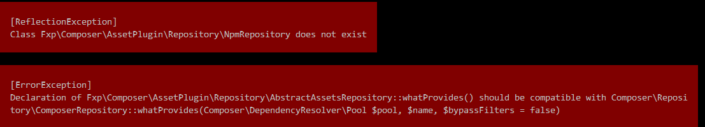
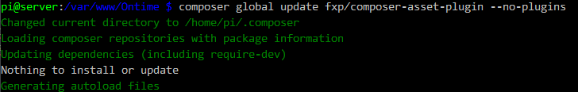

##### 错误的出现

今天在用Yii2写一个项目时，使用了[material-design-lite](https://getmdl.io)这个Material Design设计语言库，
我的Yii2使用的是Composer安装的。所以我也想使用Composer配合npm来保持material-design-lite库的更新。

在composer.json添加了
```
"require" : {
    // some code
    "npm-asset/material-design-lite": "~1.3.0"，
}
```
在使用`composer update`的时候报错

##### 过程
随手Google了下错误，在stackoverflow上看到说`fxp/composer-asset-plugin`在2016年更新了，导致`Composer\Repository\ComposerRepository::whatProvides`的API更新了。我的Composer是很久没有用过了，所以可能是这个问题。所以尝试更新`fxp/composer-asset-plugin`。

```
composer global update fxp/composer-asset-plugin --no-plugins
# composer不是全局模式的使用
php composer.phar global update fxp/composer-asset-plugin --no-plugins
```
然而发现我的并不用更新。


##### 错误的解决
但是错误还是没有解决。折腾了很久，完全没有头绪，遂使用了金典的`重启 重装大法`。
报错说Fxp丢失了文件。删除整个Fxp文件夹，然后再更新，让它重装好需要的包。
```
rm -rf ~/.composer/vendor/Fxp
composer update
```
问题解决，我的操作是在Yii的项目文件目录下操作的。上面的操作已经帮我安装好了`material-design-lite`,并更新了Yii使用的一些库。
