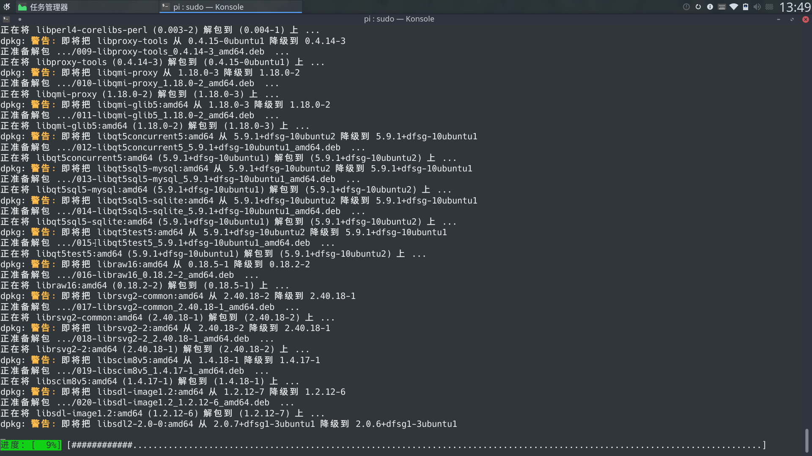
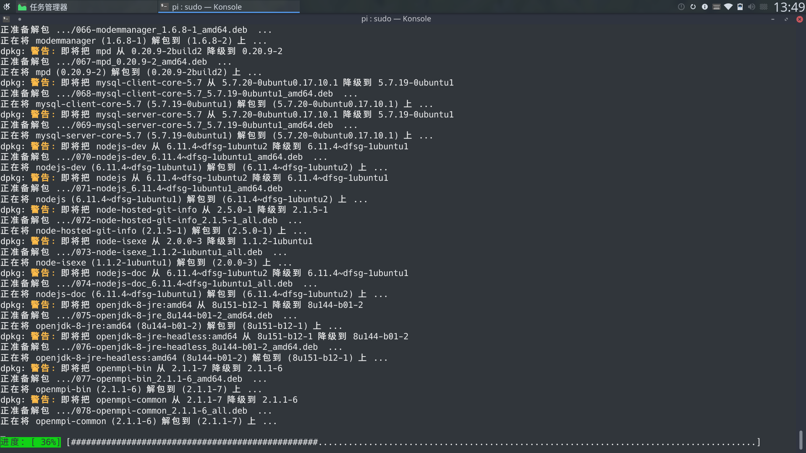
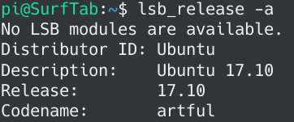

最近看 Ubuntu 17.10 正式版上线了，就把我的寨板Cube iWrok 1x,升级到了Ubuntu 17.10，但是Ubuntu 17.10默认使用 wayland 的 gnome-shell 消耗了大量的系统资源。我的寨板使用的是Intel Atom x5-Z8350，对此已经力不从心了，不要说运行其他的。遂将 Gnome 替换成 KDE5 Plasma，配置完成后发现 KDE5.10 版本使用了 Arc theme 后符合我的直男审美。就像把我主力机使用的 Pantheon 替换成 KDE5。问题就来了。

### 不要抱着试一试的心态，想清楚了再干

我的主力机使用的是基于 Ubuntu 16.04.2 LTS 的 Elementary OS，所以deb包管理的源列表使用的是Elementary OS和Ubuntu xenial。在Ubuntu xenial下KDE的最新版本为 [5.5.5](https://packages.ubuntu.com/xenial/plasma-desktop)，不是Ubuntu artful下的 [5.10.x](https://packages.ubuntu.com/artful/plasma-desktop)。

不是最新的版本，不爽值+1，看了看我当前的系统，网易云音乐 1.0.0-2 在 Pantheon 桌面下没有状态栏菜单，网易云音乐 1.1.0 正式版又是不能运行。fcitx + fcitx-googlepinyin 存在bug，打拼音会时常发生单个字母直接输入，没有读取到拼音中，不如打连打“拼音”，拼音“pinyin”。字母漏掉输入框中变成了“皮n因”，拼音“piyin”。所以我决定把我的Elementary OS基于 Ubuntu 16.04.2 LTS，升级到Ubuntu 17.10。

#### 升级Ubuntu

一般Ubuntu16.04升级Ubuntu17，只要把 Update-manager 中的 Release upgrade 的“长期支持版本(Long term support releases only)”改为“任何新版本(Normal Releases)”。或者直接修改配置文件`/etc/update-manager/release-upgrades`，把`Prompt=lts`修改为`Prompt=normal`。
```
[DEFAULT]
# Default prompting behavior, valid options:
#
#  never  - Never check for a new release.
#  normal - Check to see if a new release is available.  If more than one new
#           release is found, the release upgrader will attempt to upgrade to
#           the release that immediately succeeds the currently-running
#           release.
#  lts    - Check to see if a new LTS release is available.  The upgrader
#           will attempt to upgrade to the first LTS release available after
#           the currently-running one.  Note that this option should not be
#           used if the currently-running release is not itself an LTS
#           release, since in that case the upgrader won't be able to
#           determine if a newer release is available.
Prompt=normal
```
> 因为Ubuntu16.04是一个长期支持版本，官方对他会进行5年的支持，所以Ubuntu16.04全称为Ubuntu16.04 LTS(Long term support)，Ubuntu16.04 LTS最近更新版本2017/8/3的Ubuntu16.04.3 LTS。LTS版本每两年发布一次，最新的LTS为Ubuntu16.04，上一版本为Ubuntu14.04，下一次发布版本将为Ubuntu18.04。而普通版本只有9个月的技术支持。

在更改后只需执行`sudo do-release-upgrade`就可以升级到新本版。因为我是在网上了google了这个命令，google上说是`do-release-upgrade -d`。我并没有查这他的具体意义，就在我的Consle中执行了。

我的Consle包含了多个标签。因为我喜欢打开多个标签，一个标签单独来运行`sslocal`进行科学上网。可以查看这个[链接](../use-Kcptun-to-speed-up-Shadowsocks/)。多个单独标签`ssh`我的其他机器。当我发现我把`sudo do-release-upgrade -
d`执行错了标签时，已经在更新很多软件包了，快要结束了(我的主力机 pi@Phoenix，和寨板pi@SurfTab 太相似了)。没错我把我SSH连接的机器更新了，我SSH连接的这台就是我的寨板，他当前的系统是Ubuntu17.10，他默认设置‘任何新版本’就可以更新(Prompt=normal)。查看`do-release-upgrade`：
```Ini
Usage: do-release-upgrade [options]

Options:
  -h, --help            show this help message and exit
  -V, --version         显示版本并退出
  -d, --devel-release   If using the latest supported release, upgrade to the
                        development release
  --data-dir=DATA_DIR   包含数据文件的文件夹
  -p, --proposed        尝试通过 $distro-proposed 更新到最新版本。
  -m MODE, --mode=MODE  以特定模式升级。 目前支持：用“桌面”为桌面系统，“服务器”为服务器系统升级。
  -f FRONTEND, --frontend=FRONTEND
                        运行指定的前端
  -c, --check-dist-upgrade-only
                        仅在有新的发行版发布时检查，并通过退出码(exit code)报告结果
  -q, --quiet 
```
`-d`的参数就是安装开发版，所以我的寨板是直接更新到Ubuntu18.04 Development版本。但当时我注意到。我在想把我的主力机升级到Ubuntu 17.10。


在我的主力机上，因为是Elementary OS，不包含Ubuntu的图形化程序 Update-manager，只能通过更改配置文件，再执行`sudo do-release-upgrade`。但是执行后提示
```
正在检查新版 Ubuntu
No new release found.
```
Elementary OS的软件源使用了Elementary OS自己的，不是Ubuntu官方的。所以`do-release-upgrade`也是在更新Elementary OS本身。所以我想更该软件源为Ubuntu。我直接复制了寨板的`source.list`文件。更新了当前所有软件包
```bash
pi@SurfTab$ scp /etc/apt/sources.list root@Phoenix:/etc/apt/

pi@Phoenix$ sudo apt update && sudo apt dist-upgrade
```
更新完重启。因为之前是Pantheon桌面，在更新后没法运行。 `Ctrl+Alt+F1`切换到 tty1，安装上KDE桌面环境。进入系统使用`lsb_release -a`查看系统版本。
```
Distributor ID: Ubuntu
Description:    Ubuntu 18.04 Dev
Release:        18.04
Codename:       bionic
```

#### Ubuntu 降级

和寨板一样直接升级到了 Ubuntu 18.04。回过头查看`/etc/apt/sources.list`这个文件
```Bash
# deb cdrom:[Kubuntu 17.10 _Artful Aardvark_ - Release amd64 (20171017.1)]/ artful main multiverse restricted universe

# See http://help.ubuntu.com/community/UpgradeNotes for how to upgrade to
# newer versions of the distribution.

deb http://mirrors.tuna.tsinghua.edu.cn/ubuntu/ bionic main restricted
# deb-src http://cn.archive.ubuntu.com/ubuntu/ artful main restricted

## Major bug fix updates produced after the final release of the
## distribution.

deb http://mirrors.tuna.tsinghua.edu.cn/ubuntu/ bionic-updates main restricted
# deb-src http://cn.archive.ubuntu.com/ubuntu/ artful-updates main restricted

## N.B. software from this repository is ENTIRELY UNSUPPORTED by the Ubuntu
## team. Also, please note that software in universe WILL NOT receive any
## review or updates from the Ubuntu security team.

deb http://mirrors.tuna.tsinghua.edu.cn/ubuntu/ bionic universe
# deb-src http://cn.archive.ubuntu.com/ubuntu/ artful universe

deb http://mirrors.tuna.tsinghua.edu.cn/ubuntu/ bionic-updates universe
# deb-src http://cn.archive.ubuntu.com/ubuntu/ artful-updates universe

## N.B. software from this repository is ENTIRELY UNSUPPORTED by the Ubuntu 
## team, and may not be under a free licence. Please satisfy yourself as to 
## your rights to use the software. Also, please note that software in 
## multiverse WILL NOT receive any review or updates from the Ubuntu
## security team.

deb http://mirrors.tuna.tsinghua.edu.cn/ubuntu/ bionic multiverse
# deb-src http://cn.archive.ubuntu.com/ubuntu/ artful multiverse

deb http://mirrors.tuna.tsinghua.edu.cn/ubuntu/ bionic-updates multiverse
# deb-src http://cn.archive.ubuntu.com/ubuntu/ artful-updates multiverse

## N.B. software from this repository may not have been tested as
## extensively as that contained in the main release, although it includes
## newer versions of some applications which may provide useful features.
## Also, please note that software in backports WILL NOT receive any review
## or updates from the Ubuntu security team.

deb http://mirrors.tuna.tsinghua.edu.cn/ubuntu/ bionic-backports main restricted universe multiverse
# deb-src http://cn.archive.ubuntu.com/ubuntu/ artful-backports main restricted universe multiverse

## Uncomment the following two lines to add software from Canonical's
## 'partner' repository.
## This software is not part of Ubuntu, but is offered by Canonical and the
## respective vendors as a service to Ubuntu users.
# deb http://archive.canonical.com/ubuntu artful partner
# deb-src http://archive.canonical.com/ubuntu artful partner


deb http://mirrors.tuna.tsinghua.edu.cn/ubuntu/ bionic-security main restricted
# deb-src http://security.ubuntu.com/ubuntu artful-security main restricted

deb http://mirrors.tuna.tsinghua.edu.cn/ubuntu/ bionic-security universe
# deb-src http://security.ubuntu.com/ubuntu artful-security universe

deb http://mirrors.tuna.tsinghua.edu.cn/ubuntu/ bionic-security multiverse
# deb-src http://security.ubuntu.com/ubuntu artful-security multiverse
```
原本为Ubuntu 17.10代号的artful以及更该为了Ubuntu 18.04的代号bionic。所有的软件包都更新到Ubuntu 18.04。系统现在也为Ubuntu 18.04了。在我拷贝寨板的软件源的时候，他的升级程序以及把这个文件更新了，直接拷贝没有检查所以双双更新Ubuntu 18.04。:smile:

因为是开发版，实际使用过程中可能出现各种BUG，只好降级会Ubuntu 17.10。
##### 第一步： 软件源中添加想要降级版本的源。
所以上面的`/etc/apt/sources.list`改为
```Bash

# deb cdrom:[Kubuntu 17.10 _Artful Aardvark_ - Release amd64 (20171017.1)]/ artful main multiverse restricted universe

# See http://help.ubuntu.com/community/UpgradeNotes for how to upgrade to
# newer versions of the distribution.
deb http://mirrors.tuna.tsinghua.edu.cn/ubuntu/ artful main restricted
deb http://mirrors.tuna.tsinghua.edu.cn/ubuntu/ bionic main restricted
# deb-src http://cn.archive.ubuntu.com/ubuntu/ artful main restricted

## Major bug fix updates produced after the final release of the
## distribution.
deb http://mirrors.tuna.tsinghua.edu.cn/ubuntu/ artful-updates main restricted
deb http://mirrors.tuna.tsinghua.edu.cn/ubuntu/ bionic-updates main restricted
# deb-src http://cn.archive.ubuntu.com/ubuntu/ artful-updates main restricted

## N.B. software from this repository is ENTIRELY UNSUPPORTED by the Ubuntu
## team. Also, please note that software in universe WILL NOT receive any
## review or updates from the Ubuntu security team.
deb http://mirrors.tuna.tsinghua.edu.cn/ubuntu/ artful universe
deb http://mirrors.tuna.tsinghua.edu.cn/ubuntu/ bionic universe
# deb-src http://cn.archive.ubuntu.com/ubuntu/ artful universe
deb http://mirrors.tuna.tsinghua.edu.cn/ubuntu/ artful-updates universe
deb http://mirrors.tuna.tsinghua.edu.cn/ubuntu/ bionic-updates universe
# deb-src http://cn.archive.ubuntu.com/ubuntu/ artful-updates universe

## N.B. software from this repository is ENTIRELY UNSUPPORTED by the Ubuntu 
## team, and may not be under a free licence. Please satisfy yourself as to 
## your rights to use the software. Also, please note that software in 
## multiverse WILL NOT receive any review or updates from the Ubuntu
## security team.
deb http://mirrors.tuna.tsinghua.edu.cn/ubuntu/ artful multiverse
deb http://mirrors.tuna.tsinghua.edu.cn/ubuntu/ bionic multiverse
# deb-src http://cn.archive.ubuntu.com/ubuntu/ artful multiverse
deb http://mirrors.tuna.tsinghua.edu.cn/ubuntu/ artful-updates multiverse
deb http://mirrors.tuna.tsinghua.edu.cn/ubuntu/ bionic-updates multiverse
# deb-src http://cn.archive.ubuntu.com/ubuntu/ artful-updates multiverse

## N.B. software from this repository may not have been tested as
## extensively as that contained in the main release, although it includes
## newer versions of some applications which may provide useful features.
## Also, please note that software in backports WILL NOT receive any review
## or updates from the Ubuntu security team.
deb http://mirrors.tuna.tsinghua.edu.cn/ubuntu/ artful-backports main restricted universe multiverse
deb http://mirrors.tuna.tsinghua.edu.cn/ubuntu/ bionic-backports main restricted universe multiverse
# deb-src http://cn.archive.ubuntu.com/ubuntu/ artful-backports main restricted universe multiverse

## Uncomment the following two lines to add software from Canonical's
## 'partner' repository.
## This software is not part of Ubuntu, but is offered by Canonical and the
## respective vendors as a service to Ubuntu users.
# deb http://archive.canonical.com/ubuntu artful partner
# deb-src http://archive.canonical.com/ubuntu artful partner

deb http://mirrors.tuna.tsinghua.edu.cn/ubuntu/ artful-security main restricted
deb http://mirrors.tuna.tsinghua.edu.cn/ubuntu/ bionic-security main restricted
# deb-src http://security.ubuntu.com/ubuntu artful-security main restricted
deb http://mirrors.tuna.tsinghua.edu.cn/ubuntu/ artful-security universe
deb http://mirrors.tuna.tsinghua.edu.cn/ubuntu/ bionic-security universe
# deb-src http://security.ubuntu.com/ubuntu artful-security universe
deb http://mirrors.tuna.tsinghua.edu.cn/ubuntu/ artful-security multiverse
deb http://mirrors.tuna.tsinghua.edu.cn/ubuntu/ bionic-security multiverse
# deb-src http://security.ubuntu.com/ubuntu artful-security multiverse
```

##### 第二步：建立`/etc/apt/preferences`文件
/etc/apt/preferences 内容
```Bash
#/etc/apt/preferences
Package: *
Pin: release a=artful
Pin-Priority: 1001

Package: *
Pin: release a=bionic
Pin-Priority: 60
```
这样artful的优先级高于bionic，优先安装。
```Bash
sudo apt update && sudo apt-get dist-upgrade
```


重启
```Bash
reboot
```


搞定