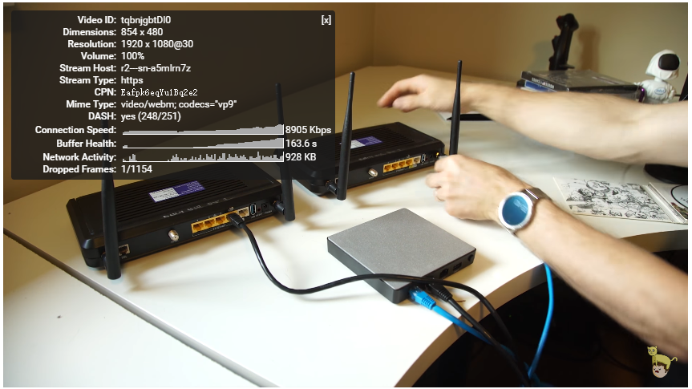

最近终于忍受不了访问Google速度慢，搜索东西时url改变了，但还是停在Google首页！！！！，还有atom插件老奔溃，插件一奔溃就检查是否有更新。然而一更新半年都没反应。

偶然间读到一篇关于Google BBR拥塞算法，他是一个TCP加速优化工具，用于优化 TCP 连接，听说最近挺火的。有不少人用来优化Shadowsocks的TCP连接，翻墙的速度翻了倍。`（聪明的你发现了这个标题不符啊，这个下面来详述。）`这使我燃起了购买海外VPS的欲望，遂买了搬瓦工[https://bandwagonhost.com/](https://bandwagonhost.com/)一年的VPS`（他家支持支付宝，运气好的话还可以买到3.99$/year。）`。


### Shadowsocks

在安装好系统后，`（我这安装的是Ubuntu16.04，搬瓦工默认是centOS6）` 搬瓦工贴心的给你设置了不好记的密码，常用服务端口号也改成了不常用的了，所以我修改Root密码，更改了SSH端口号，方便自己。

#### 创建Shadowsocks服务
Shadowsocks服务端有不同的语言版本的，Shadowsocks服务端主流有：

* shadowsocks-nodejs
* shadowsocks-libev
* shadowsocks-python
* shadowsocks-go

我选择了python版的，因为刚刚安装的系统，python没有包管理pip，先要安装pip
```
wget https://bootstrap.pypa.io/get-pip.py
python get-pip.py
```
安装Shadowsocks
```
pip install shadowsocks
```
然后创建一个shadowsocks配置文件。个人习惯使用nano而不是vi或vim，vi的操作繁琐，在加上ssh连接有延迟，修改文本很难操作。一般nano不是默认都有的，所以先安装上。
```
apt-get isntall nano
touch /etc/shadowsocks.json
nano /etc/shadowsocks.json
```
根据自己的服务器输入如下内容：
```json
{
    "server" : "server_ip",
    "server_port" : "8388",
    "password" : "password",
    "method":"aes-256-cfb",
}
```
配置文件中个字段的含义：
* server: 服务器ip地址
* server_port: 绑定shadowsocks端口，注意不要设置已经使用了的端口
* possword: 设置shadowsocks连接密码
* method: 加密方式

如果有多个账号来使用Shadowsocks服务，该这样来配置
```json
{
    "server" : "server_ip",
    "port_password" : {
        "8388" : "password1",
        "8389" : "password2",
        "8390" : "password3",
    },
    "method":"aes-256-cfb",
}
```
每个端口有一个密码，配置项由`password`改为`port_password`。
**注意，当开启使用多用户时，`server`项的值必须为`0.0.0.0`，否则不能启动多个端口**

#### 启动或关闭Shadowsocks服务
启动
```
ssserver -c /etc/shadowsocks.json -d start
```
关闭为
```
ssserver -c /etc/shadowsocks.json -d stop
```
Shadowsocks服务我想开机自动启动。所以把启动的命令加入了开机启动中。编辑`/etc/rc.local`，将`ssserver -c /etc/shadowsocks.json -d start`添加到`exit 0;`之前就可以了。

#### Shadowsocks提速

配置好Shadowsocks后，测试成功了，该使用BBR来为Shadowsocks提速了，BBR是Google的一个开源项目，在Google的github官方项目下。github地址[https://github.com/google/bbr](https://github.com/google/bbr)。
但是注意了在项目的README文件中有 “This is not an official Google product.” 。这就搞不懂，你自己放自己官方项目下，但又写上这么一句😂。

BBR在2016年9月20号加入到Linux内核中去了，所以只要是去年9月以后更新Linux内核，都自带了BBR。查看自己的内核版本
```
root@localhost:~# uname -r
2.6.32-042stab116.2
```
我的搬瓦工上的Ubuntu16.04内核为2.6.32，去年10月更新的Linux内核版本为4.9rc1。所以超过这个就可以了。现在2017年
3月最新的Linux内核稳定版为4.10.1。
下载安装最新的内核，我的系统为64位操作系统，所以
```
wget http://kernel.ubuntu.com/~kernel-ppa/mainline/v4.10.1/linux-headers-4.10.1-041001_4.10.1-041001.201702260735_all.deb
wget http://kernel.ubuntu.com/~kernel-ppa/mainline/v4.10.1/linux-headers-4.10.1-041001-generic_4.10.1-041001.201702260735_arm64.deb
wget http://kernel.ubuntu.com/~kernel-ppa/mainline/v4.10.1/linux-image-4.10.1-041001-generic_4.10.1-041001.201702260735_arm64.deb
dpkg -i *.deb
```
安装完成以后重启就好了。

但是万万没想到，我的重启以后查看内核版本，发现没有丝毫的变化还是`2.6.32-042stab116.2`。但是我是安装成功了的啊。
使用dpkg查看我安装内核。
```
dpkg -l | grep "linux-image"
```
也只看到了`linux-image-4.10.1-041001`,说明内核安装成功了的，但是现在正在使用的内核版本又看不见，上网Google下。

在Google上补课后发现，VPS分为OpenVZ、Xen和KVM，OpenVZ平台的VPS不能对Linux内核进行更新！！！ 而搬瓦工的又给了上古的Linux内核，所以BBR我是没法体验了。所以以后又同学买VPS，可以注意自己的使用环境，买合适的VPS。

虽然不能使用BBR，但是我在补课时发现还有其他的几种加速方式，Finalspeed、Kcptun和锐速。
锐速是收费的，网上有破解版，但是锐速要求内核版本最低为3.13   ×
Finalspeed是在搬瓦工上使用比较多，但是有反应内存占用多的情况   ×
所以我使用了Kcptun

### Kcptun
Kcptun 是 KCP 协议的一个简单应用，它可以将 TCP 转换为 KCP + UDP。由于 Kcptun 使用 Go 语言编写，内存占用低
KCP 协议一个快速可靠协议，能以 TCP 浪费10%-20%的带宽的代价，换取平均延迟降低 30%-40%，且最大延迟降低三倍的传输效果。KCP协议是我知乎唯一关注的程序猿[韦易笑](https://www.zhihu.com/people/skywind3000/answers)开发的 😊。
KCP 协议项目地址：  [https://github.com/skywind3000/kcp](https://github.com/skywind3000/kcp)
Kcptun项目地址：[https://github.com/xtaci/kcptun](https://github.com/xtaci/kcptun)

#### 部署Kcptun

Kcptun的安装部署比较简单了。因为已经有人编写了一键部署脚本，所以安装步骤 [链接](https://blog.kuoruan.com/110.html)，我就不重复一遍了。

但是在我安装的时候出错了。
```
Traceback (most recent call last):
  File "/usr/bin/easy_install", line 7, in <module>
  ****
  File "/usr/lib/python2.7/bin/easy_install", line 1, in <module>
from pkg_resources.extern import VendorImporter
ImportError: No module named extern
```

在检查后发现Python正常，extern模块是存在的。仔细阅读错误信息后发现。前后easy_install不是同一个文件。回想起来，我中途使用了
```
apt-get update
apt-get dist-upgrade
```
来更新所有的包。导致了python的路径改变。手动做一个软链接后正常。
```
rm /usr/bin/easy_install
ln -s /usr/lib/python2.7/bin/easy_install /usr/bin/easy_install
```

最后附上一张youtube效果图 可以看到youtube连接已经到了9Mbps，所以youtube 4K画质也不是问题

